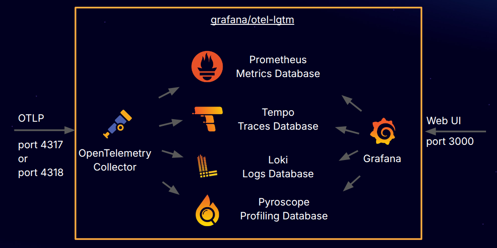

# docker-otel-lgtm

Docker 이미지로 제공되는 OpenTelemetry 백엔드입니다.



`grafana/otel-lgtm` Docker 이미지는 개발, 데모, 테스트 환경을 위한 오픈소스 OpenTelemetry 백엔드입니다.

> [!IMPORTANT]
> **프로덕션 환경**에서 OpenTelemetry와 Prometheus로 애플리케이션을 모니터링하고 MTTR(평균 해결 시간)을 최소화하려면
> [Grafana Cloud Application Observability][app-o11y]를 사용하세요.

## 문서

- 블로그 포스트: [_An OpenTelemetry backend in a Docker image: Introducing grafana/otel-lgtm_][otel-lgtm]

## Docker 이미지 받기

Docker 이미지는 Docker Hub에서 제공됩니다: <https://hub.docker.com/r/grafana/otel-lgtm>

## Docker 이미지 실행하기

### Linux/Unix

```sh
./run-lgtm.sh
```

### Windows (PowerShell)

```powershell
./run-lgtm
```

### Linux/Unix에서 mise 사용

[mise][mise]를 사용하여 Docker 이미지를 실행할 수도 있습니다:

```sh
mise run lgtm
```

## 설정

### 로깅 활성화

문제 해결을 위해 .env 파일에서 로깅을 활성화할 수 있습니다:

| 환경 변수                | 로깅 활성화 대상        |
|-------------------------|-------------------------|
| `ENABLE_LOGS_GRAFANA`    | Grafana                 |
| `ENABLE_LOGS_LOKI`       | Loki                    |
| `ENABLE_LOGS_PROMETHEUS` | Prometheus              |
| `ENABLE_LOGS_TEMPO`      | Tempo                   |
| `ENABLE_LOGS_PYROSCOPE`  | Pyroscope               |
| `ENABLE_LOGS_OTELCOL`    | OpenTelemetry Collector |
| `ENABLE_LOGS_ALL`        | 위의 모든 항목          |

이는 OpenTelemetry로 수집되는 애플리케이션 로그와는 무관합니다.

### 벤더에 데이터 전송

내장된 관측성 도구 외에도 벤더에 데이터를 전송할 수 있습니다.
이를 통해 다양한 백엔드를 쉽게 시도하고 전환할 수 있습니다.

[`OTEL_EXPORTER_OTLP_ENDPOINT`][otlp-endpoint] 변수가 설정되면
OpenTelemetry Collector는 "OTLP/HTTP"를 사용하여 지정된 엔드포인트로
데이터(로그, 메트릭, 추적)를 전송합니다.

또한 백엔드 인증을 위해 [`OTEL_EXPORTER_OTLP_HEADERS`][otlp-headers]를 제공할 수 있습니다.

#### Grafana Cloud로 데이터 전송

환경 변수 값은 [Grafana Cloud 계정][otel-setup]에서 확인할 수 있습니다.

### 컨테이너 재생성 시 데이터 유지

저장소의 다양한 구성요소는 `/data` 디렉토리에 데이터를 저장하도록 설정되어 있습니다.
컨테이너 생성 및 삭제 시에도 데이터를 유지해야 한다면 `/data` 디렉토리에 볼륨을 마운트할 수 있습니다.
이 이미지는 개발, 데모, 테스트 환경을 위한 것이며, 외부 볼륨에 데이터를 유지하더라도 이는 변하지 않습니다.
그러나 이 기능은 테스트 상황에서도 일부 사용자에게 유용할 수 있습니다.

### Grafana 플러그인 사전 설치

`GF_PLUGINS_PREINSTALL` 환경 변수에 추가하여 Grafana 플러그인을 사전 설치할 수 있습니다.
자세한 내용은 [Grafana 문서][grafana-preinstall-plugins]를 참조하세요.

## Kubernetes에서 lgtm 실행

```sh
# k8s 리소스 생성
kubectl apply -f k8s/lgtm.yaml

# 포트포워딩 설정
kubectl port-forward service/lgtm 3000:3000 4317:4317 4318:4318

# mise 사용
mise k8s-apply
mise k8s-port-forward
```

## OpenTelemetry 데이터 전송

별도의 설정이 필요 없습니다. Docker 이미지는 OpenTelemetry의 기본값으로 작동합니다.

```sh
# 필수는 아니지만, OpenTelemetry의 기본값입니다
export OTEL_EXPORTER_OTLP_PROTOCOL=http/protobuf
export OTEL_EXPORTER_OTLP_ENDPOINT=http://127.0.0.1:4318
```

## Grafana 보기

<http://127.0.0.1:3000>으로 이동하여 기본 내장 사용자 `admin`과 비밀번호 `admin`으로 로그인하세요.

## Docker 이미지를 처음부터 빌드하기

```sh
cd docker/
docker build . -t grafana/otel-lgtm

# mise 사용
mise build-lgtm
```

## 예제 앱 빌드 및 실행

> [!TIP]
> [mise][mise]를 사용하여 `mise run all`로 모든 것을 함께 실행할 수 있습니다.

### 실행

예제 REST 서비스 실행:

#### Unix/Linux

```sh
./run-example.sh
```

#### Windows (PowerShell)

```powershell
./run-example
```

#### Unix/Linux에서 mise 사용

```sh
mise run example
```

### 트래픽 생성

#### Unix/Linux

```sh
./generate-traffic.sh
```

#### Windows (PowerShell)

```powershell
./generate-traffic
```

#### Unix/Linux에서 mise 사용

```sh
mise run generate-traffic
```

> [!TIP]
> [OTel Checker][otel-checker]를 사용하여 계측이 올바른지 확인할 수 있습니다.

## 다양한 언어로 된 예제 앱 실행

예제 앱은 [`examples/`][examples] 디렉토리에 있습니다.
각 예제에는 앱을 시작하는 `run.sh` 또는 `run.cmd` 스크립트가 있습니다.

모든 예제는 1과 6 사이의 난수를 반환하는 주사위 굴리기(rolldice) 서비스를 구현합니다.

각 예제는 서로 다른 애플리케이션 포트를 사용합니다
(모든 애플리케이션을 동시에 실행할 수 있도록).

| 예제    | 서비스 URL                            |
|---------|---------------------------------------|
| Java    | `curl http://127.0.0.1:8080/rolldice` |
| Go      | `curl http://127.0.0.1:8081/rolldice` |
| Python  | `curl http://127.0.0.1:8082/rolldice` |
| .NET    | `curl http://127.0.0.1:8083/rolldice` |
| Node.js | `curl http://127.0.0.1:8084/rolldice` |

## 빠른 시작 가이드 (초보자용)

### 1단계: 모니터링 시스템 시작
```sh
./run-lgtm.sh
```

### 2단계: 예제 앱 실행
```sh
./run-example.sh
```

### 3단계: 테스트 트래픽 생성
```sh
./generate-traffic.sh
```

### 4단계: Grafana에서 확인
브라우저에서 `http://127.0.0.1:3000`에 접속
- 사용자: `admin`
- 비밀번호: `admin`

이제 대시보드에서 메트릭, 로그, 추적 정보를 확인할 수 있습니다!

## 관련 프로젝트

- [Metrics, Logs, Traces and Profiles in Grafana][mltp]
- [OpenTelemetry Acceptance Tests (OATs)][oats]

[app-o11y]: https://grafana.com/products/cloud/application-observability/
[examples]: https://github.com/grafana/docker-otel-lgtm/tree/main/examples
[grafana-preinstall-plugins]: https://grafana.com/docs/grafana/latest/setup-grafana/configure-docker/#install-plugins-in-the-docker-container
[mise]: https://github.com/jdx/mise
[mltp]: https://github.com/grafana/intro-to-mltp
[otel-checker]: https://github.com/grafana/otel-checker/
[otel-lgtm]: https://grafana.com/blog/2024/03/13/an-opentelemetry-backend-in-a-docker-image-introducing-grafana/otel-lgtm/
[otel-setup]: https://grafana.com/docs/grafana-cloud/send-data/otlp/send-data-otlp/#manual-opentelemetry-setup-for-advanced-users
[otlp-endpoint]: https://opentelemetry.io/docs/languages/sdk-configuration/otlp-exporter/#otel_exporter_otlp_endpoint
[otlp-headers]: https://opentelemetry.io/docs/languages/sdk-configuration/otlp-exporter/#otel_exporter_otlp_headers
[oats]: https://github.com/grafana/oats
