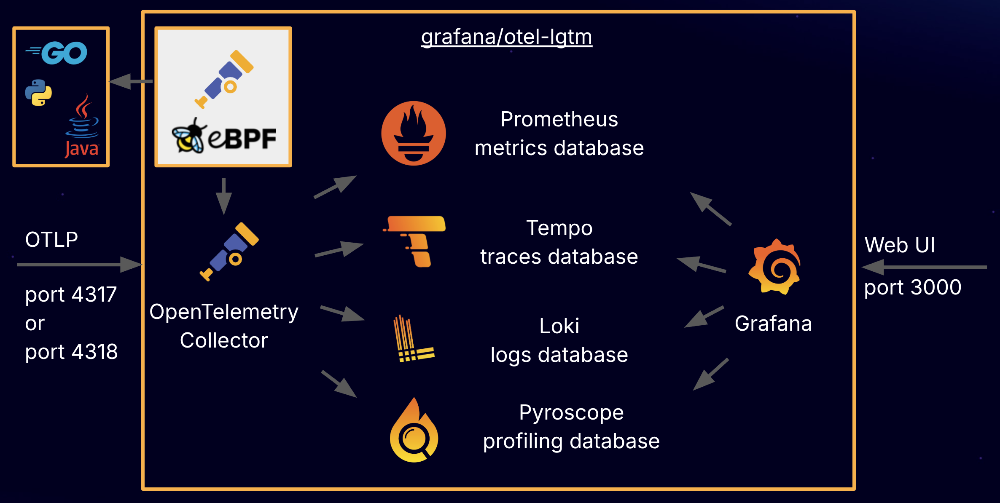

# docker-otel-lgtm

An OpenTelemetry backend in a Docker image.



The `grafana/otel-lgtm` Docker image is an open source backend for OpenTelemetry that’s intended for development, demo, and testing environments. If you are looking for a production-ready, out-of-the box solution to monitor applications and minimize MTTR (mean time to resolution) with OpenTelemetry and Prometheus, you should try [Grafana Cloud Application Observability](https://grafana.com/products/cloud/application-observability/).

## Documentation

* Blog post: [An OpenTelemetry backend in a Docker image: Introducing grafana/otel-lgtm](https://grafana.com/blog/2024/03/13/an-opentelemetry-backend-in-a-docker-image-introducing-grafana/otel-lgtm/)

## Get the Docker image

The Docker image is available on Docker hub: <https://hub.docker.com/r/grafana/otel-lgtm>

## Run the Docker image

```sh
# Unix/Linux
./run-lgtm.sh

# Windows (PowerShell)
./run-lgtm
```

### Configuration

#### Enable logging

You can enable logging for troubleshooting:

| Environment Variable   | Enable Logging in       |
|------------------------|-------------------------|
| ENABLE_LOGS_GRAFANA    | Grafana                 |
| ENABLE_LOGS_LOKI       | Loki                    |
| ENABLE_LOGS_PROMETHEUS | Prometheus              |
| ENABLE_LOGS_TEMPO      | Tempo                   |
| ENABLE_LOGS_OTELCOL    | OpenTelemetry Collector |
| ENABLE_LOGS_ALL        | all of the above        |

This has nothing to do with the application logs, which are collected by OpenTelemetry.

## Run lgtm in kubernetes

```sh
# create k8s resources
kubectl apply -f k8s/lgtm.yaml

# port forwarding
kubectl port-forward service/lgtm 3000:3000 4317:4317 4318:4318
```

## Send OpenTelemetry Data

There's no need to configure anything: The Docker image works with OpenTelemetry's defaults.

```sh
# Not needed as these are the defaults in OpenTelemetry:
export OTEL_EXPORTER_OTLP_PROTOCOL=http/protobuf
export OTEL_EXPORTER_OTLP_ENDPOINT=http://localhost:4318
```

## View Grafana

Log in to [http://localhost:3000](http://localhost:3000) with user _admin_ and password _admin_.

## Build the Docker image from scratch

```sh
cd docker/
docker build . -t grafana/otel-lgtm
```

## Build and run the example app

Run the example REST service:

```sh
# Unix/Linux
./run-example.sh

# Windows (PowerShell)
./run-example
```

Generate traffic:

```sh
# Unix/Linux
./generate-traffic.sh

# Windows (PowerShell)
./generate-traffic
```

## Run example apps in different languages

The example apps are in the `examples/` directory.
Each example has a `run.sh` or `run.cmd` script to start the app.

Every example implements a rolldice service, which returns a random number between 1 and 6.

Each example uses a different application port (to be able to run all applications at the same time).

| Example | Service URL                           |
|---------|---------------------------------------|
| Java    | `curl http://localhost:8080/rolldice` |
| Go      | `curl http://localhost:8081/rolldice` |
| Python  | `curl http://localhost:8082/rolldice` |
| dotnet  | `curl http://localhost:8083/rolldice` |

## Related Work

* Metrics, Logs, Traces and Profiles in Grafana: <https://github.com/grafana/intro-to-mltp>
