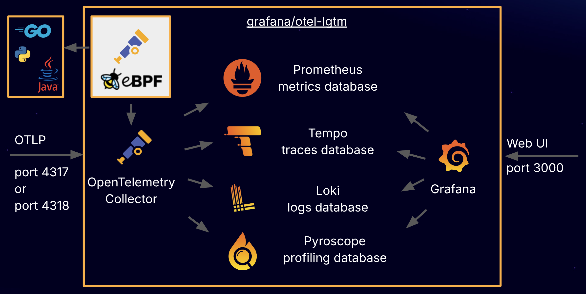
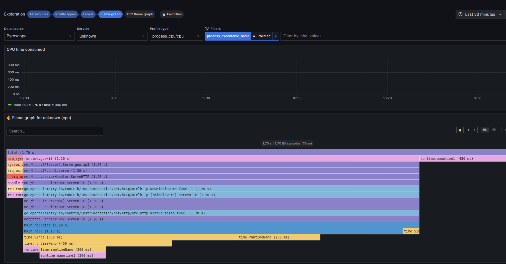

# Blog Post

## Authors 

Gregor Zeitlinger, Matt Hensley

## Title

Observability in Under 5 Seconds: grafana/otel-lgtm turns 1 year old!

## Content

Happy Birthday to `grafana/otel-lgtm`! Over the past year, it has achieved 1k stars, celebrated version 0.11.1, and made observability just one docker command away.


`grafana/otel-lgtm` is a Docker image that provides a complete Open Source OpenTelemetry solution. It bundles several key tools to cover all aspects of observability:
*   **[OpenTelemetry Collector](https://opentelemetry.io/docs/collector/)**: Receives and forwards telemetry signals to observability backends.
*   **[Prometheus](https://github.com/prometheus/prometheus)**: Stores and queries your application's metrics (e.g., request rates, error counts, system health).
*   **[Loki](https://github.com/grafana/loki/)**: Stores and queries your application's logs.
*   **[Tempo](https://github.com/grafana/tempo/)**: Stores and queries traces, which show the path of a request as it journeys through your different services.
*   **[Pyroscope](https://github.com/grafana/pyroscope)**: Stores and queries profiles, helping you understand which parts of your code are consuming the most resources (like CPU time or memory).
*   **[Grafana](https://github.com/grafana/grafana)**: Visualizes all this data in dashboards, allowing you to see metrics, logs, traces, and profiles in one place.



### Quickstart

The OpenTelemetry Collector receives signals on ports 4317 (gRPC) and 4318 (HTTP). It forwards:
- Metrics to Prometheus
- Traces to Tempo
- Logs to Loki
- Profiles to Pyroscope

Grafana is pre-configured with these data sources and exposes its Web UI on port 3000.

1. Run the following command to start the stack:

   ```bash
   docker run --name lgtm -p 3000:3000 -p 4317:4317 -p 4318:4318 --rm -ti grafana/otel-lgtm
   ```

2. Wait for the log message `The OpenTelemetry collector and the Grafana LGTM stack are up and running.` or for the `/tmp/ready` file to appear - which will appear in a couple of seconds.

3. Start your [OpenTelemetry-exporting application](https://opentelemetry.io/docs/zero-code/). Example applications are available in the [repository](https://github.com/grafana/docker-otel-lgtm/tree/main/examples).

4. Open [http://localhost:3000/](http://localhost:3000/) in your browser to view metrics, logs, traces, and profiles.


The `grafana/otel-lgtm` Docker image is for development, demo, and testing. For production, refer to [Grafana Cloud Application Observability](https://grafana.com/products/cloud/application-observability/).


### One year later

`grafana/otel-lgtm` has made it easier for projects to create a demo setup for observability. Some notable adopters include:

- [Deno](https://docs.deno.com/runtime/fundamentals/open_telemetry/) (JavaScript)
- [Quarkus](https://quarkus.io/guides/observability-devservices-lgtm) (Java)
- [Bootzooka](https://github.com/softwaremill/bootzooka) (Scala)
- [Roadster](https://github.com/roadster-rs/roadster) (Rust)
- [Embrace Observability](https://github.com/embrace-io/react-otel-sample/blob/main/backend/grafana.Dockerfile) (Kotlin)

Even a [free course from Aalto University](https://csfoundations.cs.aalto.fi/en/courses/designing-and-building-scalable-web-applications/part-6/3-lgtm-stack) includes lessons on the LGTM stack.

A big thank you to the community for contributions like:
- [Node.js example](https://github.com/grafana/docker-otel-lgtm/pull/284)
- [PowerShell support](https://github.com/grafana/docker-otel-lgtm/pull/275)
- [Publishing on GitHub Registry](https://github.com/grafana/docker-otel-lgtm/pull/160)


[OATs](https://github.com/grafana/oats) is a no-code test framework based on `grafana/otel-lgtm`. Test your application using YAML. Example:

```yaml
expected:
  traces:
    - traceql: '{ span.http.route = "/rolldice/{player?}" }'
      spans:
        - name: "GET /rolldice/{player?}"
          attributes:
            otel.library.name: Microsoft.AspNetCore
```


# What’s new

## Faster startup time
   
The most requested feature was faster startup. We reduced the startup time from ~60 seconds to **under 5 seconds**. Key improvements include:
- Reducing the Prometheus health check scrape interval from 1 minute to 1 second.
- Using the [health check extension](https://github.com/grafana/docker-otel-lgtm/blob/main/docker/otelcol-config.yaml) for faster readiness detection.
- Optimizing database configurations for DNS lookups and readiness.

These changes are optimized for fast startup, not for high scalability.

#### Grafana Pyroscope Integration

Profiling is the latest OpenTelemetry signal, and we’ve added [Grafana Pyroscope](https://github.com/grafana/pyroscope) as the fourth database. Profiling helps you understand which parts of your code are consuming the most resources (like CPU time or memory). This is crucial for identifying performance bottlenecks and optimizing your application. This allows you to seamlessly blend traces and profiles to optimize your critical paths.



To try the [eBPF profiler example](https://github.com/grafana/docker-otel-lgtm/tree/main/examples/ebpf-profiler):
1. Navigate to the example directory: `cd examples/ebpf-profiler`
2. Start the stack: `docker compose up --remove-orphans --build`
3. Open [Drilldown Profiles](http://localhost:3000/a/grafana-pyroscope-app/explore) in Grafana.
4. Filter by `process_executable_name = rolldice` and explore the Flame Graph.

### Conclusion

Over the past year, `grafana/otel-lgtm` has simplified observability setups, enabling developers to get a complete OpenTelemetry stack running in under 5 seconds with a single Docker command. With integrations for metrics, logs, traces, and now profiles via Grafana Pyroscope, it has become a go-to solution for demos, development, and testing, as evidenced by its growing community and notable adopters.

Grafana Labs remains dedicated to the OpenTelemetry project, continuously enhancing `grafana/otel-lgtm` and other tools to empower users in their observability journey.

Experience the ease of observability: try [grafana/docker-otel-lgtm](https://github.com/grafana/docker-otel-lgtm/) today and see for yourself!

# Next steps

- Try [grafana/docker-otel-lgtm](https://github.com/grafana/docker-otel-lgtm/)
- Refer to [Grafana Cloud Application Observability](https://grafana.com/products/cloud/application-observability/) for production
- Explore [OATs](https://github.com/grafana/oats) for no-code testing

# Related documentation

- [OpenTelemetry Collector documentation](https://opentelemetry.io/docs/collector/)
- [Prometheus documentation](https://github.com/prometheus/prometheus)
- [Loki documentation](https://github.com/grafana/loki/)
- [Tempo documentation](https://github.com/grafana/tempo/)
- [Pyroscope documentation](https://github.com/grafana/pyroscope)
- [Grafana documentation](https://github.com/grafana/grafana)
- [OpenTelemetry application instrumentation](https://opentelemetry.io/docs/zero-code/)

